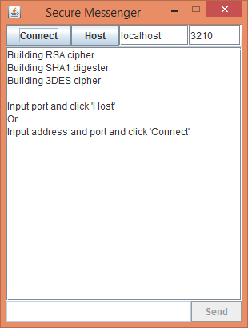
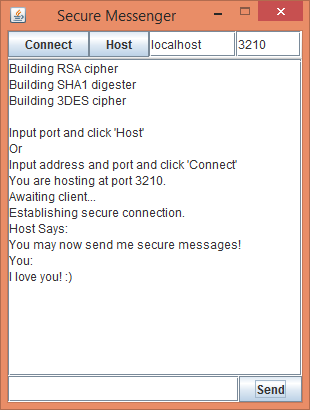
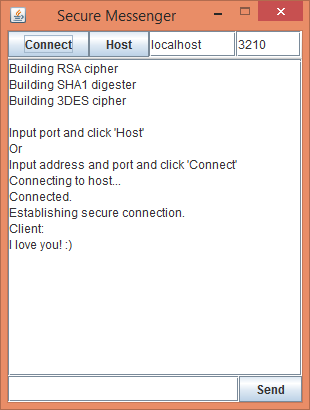

# secure-messenger
### Send secure messages over a network!

Establish secure connections with your friends and send them secret messages.
To start either click "Host" with a desired port, or "Connect" with a desired IP/Port.
The establishing of secure connection may take a few minutes.
Once a secure connection is established, messages can be sent by typing in the lower box and pressing "Send".

Some things to note:
* The Host acts as the Certificate Authority, verifying its own identity. This means that the messenger is not truely secure. The purpose is for this to a be a proof of concept, showing the proper steps to establish a secure connection assuming the CA was valid.
* The secure messenger uses RSA for asymetric encryption, SHA1 for message digests, and Triple-DES for sysmetric encryption.

This is an extension of an assignment for Computer Networking.
The original assignment, which can be see in the BobAndAlice branch, was entirely console based where Bob sent Alice a hard-coded secret message.
The connection would terminate as soon as this single message was sent.

Known issues:
- The application can get stuck on "Establishing secure connection." Usually on LANs and when communicating over certain types of firewalls.
- The GUI is somewhat unpolished. The disabling and re-enabling of certain GUI elements can be buggy. The output text is poorly formatted and hard to read. The send button will not activate when 'Enter' is pressed.
